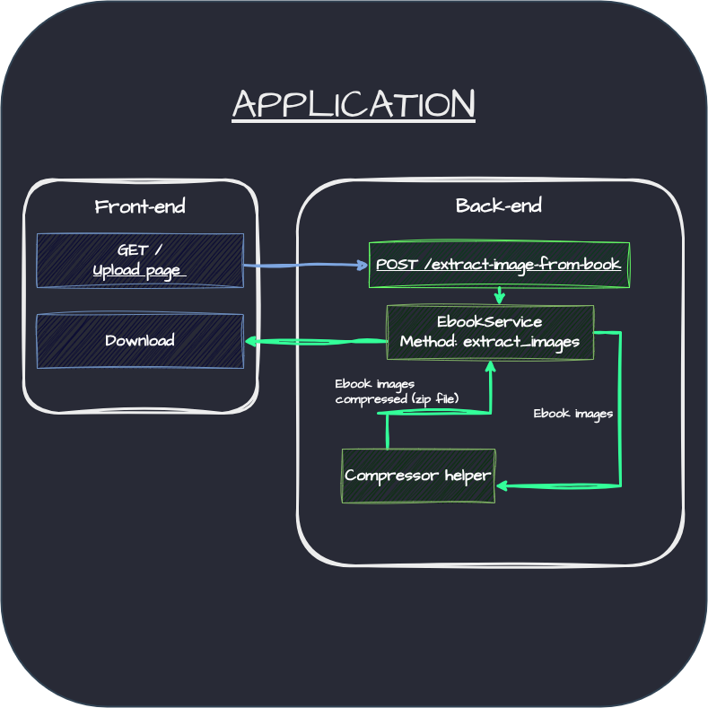

> Select the language: **English**, [Portuguese](https://github.com/kaetaen/epub-image-extractor/blob/main/README-ptbr.md)

# EPUB Image Extractor

## Description

The **EPUB Image Extractor** is a web application developed with **FastAPI** that allows users to upload EPUB files, extract the images contained within, and return a ZIP file with all the extracted images. After the ZIP file is sent, temporary files (EPUB, images, and ZIP) are automatically deleted to keep the environment clean.

## Flow Diagram



## Technologies Used

- **Python 3.10+**
- **FastAPI**: Framework for building fast and efficient APIs.
- **Uvicorn**: ASGI server to run the application.
- **Jinja2**: For rendering HTML templates.
- **EbookLib**: Library for handling EPUB files.

## Features

- Upload EPUB files.
- Extract images contained in the EPUB file.
- Compress the extracted images into a ZIP file.
- Return the ZIP file as a downloadable response.
- Automatically clean up temporary files after the response is sent.

## To-Do

### New Features

- [ ] Front-end design improvements
- [ ] Support for uploading multiple files
- [ ] Option to send the compressed file to the user's email

### Technical Debts

- [ ] Unit tests
- [ ] Verification of unit tests and code analysis with Ruff in the CI/CD pipeline


## Project Structure

```plaintext
epub-image-extractor/
├── docs
│   ├── application-flow.drawio
│   ├── application_flow.png
│   └── EPUB_Image_Extractor.postman_collection.json
├── epub-image-extractor
│   ├── helpers.py
│   ├── __init__.py
│   ├── main.py
│   └── services.py
├── static
│   ├── css
│   │   └── bootstrap
│   │       └── bootstrap.min.css
│   ├── images
│   │   └── favicon.png
│   └── js
│       └── bootstrap
│           └── bootstrap.bundle.min.js
├── templates
│   └── upload.jinja
├── pyproject.toml
├── README.md
├── README-ptbr.md
└── uv.lock
```

- `docs`: Contains project documentation files.
- `epub-image-extractor/main.py`: Project entry point.
- `epub-image-extractor/helpers.py`: Helper functions for repetitive tasks.
- `epub-image-extractor/services.py`: Responsible for the service layer.
- `templates`: Contains front-end template files (Jinja).
- `static`: Static files used by the front-end.

## Installation

1. **Install uv**

Install **uv** on your system by following the steps [on this page](https://docs.astral.sh/uv/getting-started/installation/).

2. **Clone the repository**:

```bash
git clone https://github.com/kaetaen/epub-image-extractor.git
cd epub-image-extractor
```

3. **Install dependencies**

```bash
uv sync
```

## Usage

1. **Activate the virtual environment**

```bash
source .venv/bin/activate 
```

2. **Start the server**:

```bash
uv run task serve
```

3. **Access the application**:

> Open your browser and go to: [http://localhost:8000](http://localhost:8000)

4. **Upload an EPUB file**:
   - Go to the homepage.
   - Upload an EPUB file.
   - After processing, the download will start automatically.

## Endpoints

### `GET /`
- Renders the upload page.

### `POST /upload`
- **Description**: Receives an EPUB file, extracts the images, compresses them into a ZIP file, and returns it.
- **Parameters**:
  - `epub_file` (form-data): The EPUB file uploaded by the user.
- **Response**:
  - `FileResponse`: A ZIP file containing the extracted images.


## Author

Developed by **Rubens dos Santos**